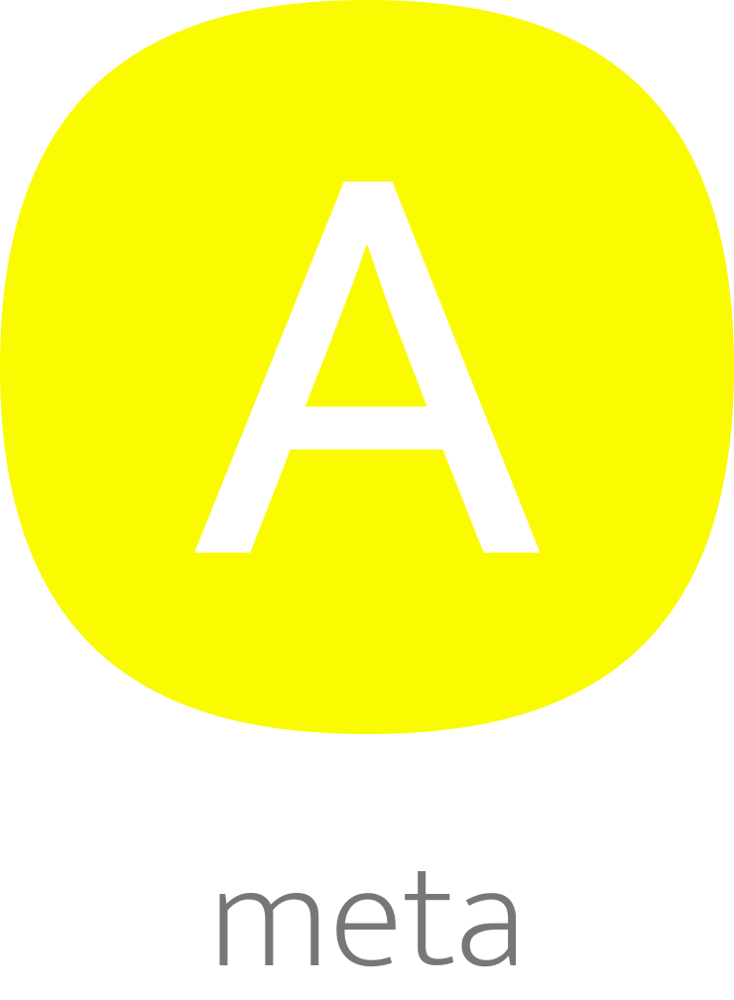

</br >
</br >

<p align='center'>
  <a target='_blank' rel='noopener noreferrer' href='#'>
    
  </a>
</p>

<h1 align='center'>amaui Meta</h1>

<p align='center'>
  Meta
</p>

<br />

<h3 align='center'>
  <sub>MIT license&nbsp;&nbsp;&nbsp;&nbsp;</sub>
  <sub>Production ready&nbsp;&nbsp;&nbsp;&nbsp;</sub>
  <sub>UMD 1.9kb gzipped&nbsp;&nbsp;&nbsp;&nbsp;</sub>
  <sub>100% test cov&nbsp;&nbsp;&nbsp;&nbsp;</sub>
  <sub>Browser and Nodejs</sub>
</h3>

<p align='center'>
    <sub>Very simple code&nbsp;&nbsp;&nbsp;&nbsp;</sub>
    <sub>Modern code&nbsp;&nbsp;&nbsp;&nbsp;</sub>
    <sub>Junior friendly&nbsp;&nbsp;&nbsp;&nbsp;</sub>
    <sub>Typescript&nbsp;&nbsp;&nbsp;&nbsp;</sub>
    <sub>Made with :yellow_heart:</sub>
</p>

<br />

## Getting started

### Add

```sh
  yarn add @amaui/meta
```

### Use

```javascript
  import AmauiMeta from '@amaui/meta';

  const object = {};

  AmauiMeta.add('a', 'a', object);
  AmauiMeta.add('a', 'a4', object, 'p');

  AmauiMeta.get('a', object);
  AmauiMeta.get('a', object, 'p');

  // Output
  // 'a'
  // 'a4'
```

### Dev

Install

```sh
  yarn
```

Test

```sh
  yarn test
```

### Prod

Build

```sh
  yarn build
```
